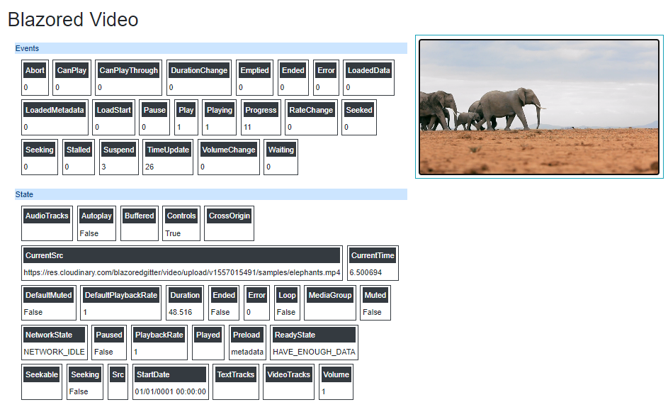

# Blazored Video

The easiest html5 `video` implementation for [Blazor](https://blazor.net) applications.




## Changelog
### 2022-24-12 Version 1.1
 - Bump dotnet version to 6.0 as 3.x and 5.x are now out of support.
 - Add standard Methods and Properties (big thanks to https://github.com/JPVenson) and Async versions (for Server/WASM). (Issues #17 #9)
 - Include video element id ("Id") and component object ref ("Video") in VideoState and VideoEventData (Issue #19) for identifying which component triggered an event.

## Getting Setup

You can install the package via the nuget package manager - just search for *Blazored.Video*. You can also install via powershell using the following command.

``` powershell
Install-Package Blazored.Video
```

Or via the dotnet CLI.

``` bash
dotnet add package Blazored.Video
```

#### Internet Explorer 11

This package can be used with Internet Explorer 11, but some special care should to be taken.

- Only Blazor Server works with IE11. Blazor WebAssembly does not work with any IE version. See [this](https://docs.microsoft.com/en-us/aspnet/core/blazor/supported-platforms?view=aspnetcore-3.1)
- A [polyfill](https://github.com/Daddoon/Blazor.Polyfill) is necessary for this component to work. See [this](https://github.com/Daddoon/Blazor.Polyfill) page for an explanation on how to install and use it. The sample project for Blazor Server uses the polyfill and thus should work on IE11

Taking these things into account, `Blazored.Video` will work on IE11.

_Note: The [sample projects](https://github.com/Blazored/Video/tree/main/samples) in this repo have IE11 support baked in._

_Note: This package is no longer tested on IE 11 - as IE support has been dropped - it may work - it's up to you to test it._

### Add Imports

Add the following to your *_Imports.razor*

``` CSharp
@using Blazored.Video
@using Blazored.Video.Support
```

## Usage
Please checkout the [sample projects](https://github.com/Blazored/Video/tree/main/samples) in this repo to see working examples of the features in the Video component. 

### Displaying a Video

Just use BlazoredVideo in place of any `video` tags.

``` html
<BlazoredVideo Play="OnPlay"
        class="w-100"
        style="max-width:800px;"
        controls="controls">
    <source src="videos/elephants.mp4" type="video/mp4" />
</BlazoredVideo>
```

This will render the html (id is auto-generated by default but you can supply your own)
``` html
<video class="w-100" id="361044add13e438cb3de299cd74272a6" controls="controls" _bl_796fa517-712e-4cf5-b8d6-7a4d940f2947=""><!--!-->
    <source src="videos/elephants.mp4" type="video/mp4">
</video>
```
### Media Events

This component maps **every media event** on the video tag using either an Action or an EventCallback - depending on your preference.

_Note: `EventCallback` events will automatically call `StateHasChanged` on the parent component, while `Action` events do not - it is your choice which you use for any event_


| Action | EventCallback | Description |
| ------ | ------------- | ----------- |
| Abort | AbortEvent | Fires when the loading of an audio/video is aborted |
| CanPlay | CanPlayEvent | Fires when the browser can start playing the audio/video |
| CanPlayThrough | CanPlayThroughEvent | Fires when the browser can play through the audio/video without stopping for buffering |
| DurationChange | DurationChangeEvent | Fires when the duration of the audio/video is changed |
| Emptied | EmptiedEvent | Fires when the current playlist is empty |
| Ended | EndedEvent | Fires when the current playlist is ended |
| Error | ErrorEvent | Fires when an error occurred during the loading of an audio/video |
| LoadedData | LoadedDataEvent | Fires when the browser has loaded the current frame of the audio/video |
| LoadedMetadata | LoadedMetadataEvent | Fires when the browser has loaded meta data for the audio/video |
| LoadStart | LoadStartEvent | Fires when the browser starts looking for the audio/video |
| Pause | PauseEvent | Fires when the audio/video has been paused |
| Play | PlayEvent | Fires when the audio/video has been started or is no longer paused |
| Playing | PlayingEvent | Fires when the audio/video is playing after having been paused or stopped for buffering |
| Progress | ProgressEvent | Fires when the browser is downloading the audio/video |
| RateChange | RateChangeEvent | Fires when the playing speed of the audio/video is changed |
| Seeked | SeekedEvent | Fires when the user is finished moving/skipping to a new position in the audio/video |
| Seeking | SeekingEvent | Fires when the user starts moving/skipping to a new position in the audio/video |
| Stalled | StalledEvent | Fires when the browser is trying to get media data, but data is not available |
| Suspend | SuspendEvent | Fires when the browser is intentionally not getting media data |
| TimeUpdate | TimeUpdateEvent | Fires when the current playback position has changed |
| VolumeChange | VolumeChangeEvent | Fires when the volume has been changed |
| Waiting | WaitingEvent | Fires when the video stops because it needs to buffer the next frame |


#### Event Data

You are in control of the data sent with every event, if the `video` element you have on your page has the data, you can request it for any event.

Event data is requested by supplying a dictionary to the VideoEventOptions parameter.

``` CSharp
[Parameter] public Dictionary<VideoEvents, VideoStateOptions> VideoEventOptions { get; set; }
```

Each entry defines the `VideoStateOptions` you require to be populated for any `VideoEvents` value.

`VideoEvents` is an enum of the Media Event names (see table above).

`VideoStateOptions` is a struct listing all the properties of the `video` element.


| Property | Description | Notes |
| --- | --- | --- |
| AudioTracks | Returns a List&lt;AudioTrack&gt; object representing available audio tracks | This is not exactly obsolete, but not yet implemented, sorry
| Autoplay | Returns whether the audio/video should start playing as soon as it is loaded |  |
| Buffered | Returns a TimeRanges object representing the buffered parts of the audio/video | This is not exactly obsolete, but not yet implemented, sorry
| Controls | Returns whether the audio/video should display controls (like play/pause etc.) |  |
| CrossOrigin | Returns the CORS settings of the audio/video |  |
| CurrentSrc | Returns the URL of the current audio/video |  |
| CurrentTime | Returns the current playback position in the audio/video (in seconds) |  |
| DefaultMuted | Returns whether the audio/video should be muted by default |  |
| DefaultPlaybackRate | Returns the default speed of the audio/video playback |  |
| Duration | Returns the length of the current audio/video (in seconds) |  |
| Ended | Returns whether the playback of the audio/video has ended or not |  |
| Error | Returns a MediaError object representing the error state of the audio/video |  |
| Loop | Returns whether the audio/video should start over again when finished |  |
| MediaGroup | Returns the group the audio/video belongs to (used to link multiple audio/video elements) |  |
| Muted | Returns whether the audio/video is muted or not |  |
| NetworkState | Returns the current network state of the audio/video |  |
| Paused | Returns whether the audio/video is paused or not |  |
| PlaybackRate | Returns the speed of the audio/video playback |  |
| Played | Returns a TimeRanges object representing the played parts of the audio/video |  |
| Preload | Returns whether the audio/video should be loaded when the page loads |  |
| ReadyState | Returns the current ready state of the audio/video |  |
| Seekable | Returns a TimeRanges object representing the seekable parts of the audio/video |  |
| Seeking | Returns whether the user is currently seeking in the audio/video |  |
| Src | Returns the current source of the audio/video element |  |
| StartDate | Returns a Date object representing the current time offset |  |
| TextTracks | Returns a TextTrackList object representing the available text tracks | This is not exactly obsolete, but not yet implemented, sorry
| VideoTracks | Returns a List&lt;VideoTrack&gt; object representing the available video tracks | This is not exactly obsolete, but not yet implemented, sorry
| Volume | Returns the volume of the audio/video |  |


Let's look at an example.

Suppose you want to subscribe to the `Play` and `TimeUpdate` events so that you can remember the position in the video and restore it when the user comes back to this video.

There are two pieces of information we might want from the `video` 

1. The name/url of the video file
2. The current timeline position

So, we create a dictionary and populate it with those options

``` csharp
Dictionary<VideoEvents, VideoStateOptions> options = new Dictionary<VideoEvents, VideoStateOptions>();

options[VideoEvents.TimeUpdate] = new VideoStateOptions { CurrentTime = true, CurrentSrc = true };

options[VideoEvents.Play] = new VideoStateOptions { CurrentSrc = true };
```

_Note: I don't really need the CurrentSrc property in both events - it's just to show having more than one selected._

Now, we can pass that to the `BlazoredVideo` component.

``` html
<BlazoredVideo PlayEvent="OnPlay" TimeUpate="OnTimeUpdate"
        VideoStateOptions="options"
        class="w-100"
        style="max-width:800px;"
        controls="controls">
    <source src="videos/elephants.mp4" type="video/mp4" />
</BlazoredVideo>
```
_Notice: I have use an EventCallback for the `play` event and an action for the `timeupdate` event - because in this case I don't want a re-render every time the `timeupdate` fires_

This will render the html
``` html
<video class="w-100" id="361044add13e438cb3de299cd74272a6" style="max-width: 800px;" controls="controls" _bl_796fa517-712e-4cf5-b8d6-7a4d940f2947=""><!--!-->
    <source src="videos/elephants.mp4" type="video/mp4">
</video>
```


Now, every time the `play` or `timeupdate` media events fire, 
they will retrieve the `currentSrc` 
and/or `currentTime` properties from the `video` element and pass that data in a `VideoState` struct.


``` csharp
void OnPlay(VideoState state)
{
    var url = state.CurrentSrc;
    // do something with this
}
void OnTimeUpdate(VideoState state)
{
    var url = state.CurrentSrc;
    var currentTime = state.CurrentTime;
    // do something with this
}
```

## Calling Standard Methods 
** Added 2022-12-24 **

The component now supports four standard methods 

| Method | Description | Notes |
| --- | --- | --- |
| StartPlayback | Start playback from C# code | `await videoRef.StartPlayback()`
| PausePlayback | Pause playback from C# code | `await videoRef.PausePlayback()`
| ReloadControl | Reload media from C# code | `await videoRef.ReloadControl()`
| CanPlayMediaType | Check media type from C# code | `bool isSupported = await videoRef.CanPlayMediaType("video/webm")`

## Get/Set Standard Properties
** Added 2022-12-24 **

The component now supports most standard properties directly from C# code.

Example - WASM only
`int duration = videoRef.Duration`

_Note: Attempting to read/write Properties from Blazor Server will throw a runtime exception telling you to use the Async versions instead. I would advise always using the async Get/Set methods as they are able to use Asynchronous or Synchronous (under WebAssembly) calls at runtime automatically, while the Properties are Synchronous only._

Example - Remote JS (Server) and WASM
`int duration = await videoRef.GetDurationAsync()`

### Customising the html

The Video can be customised using standard CSS techniques. 

All attributes are passed straight through to the HTML.

